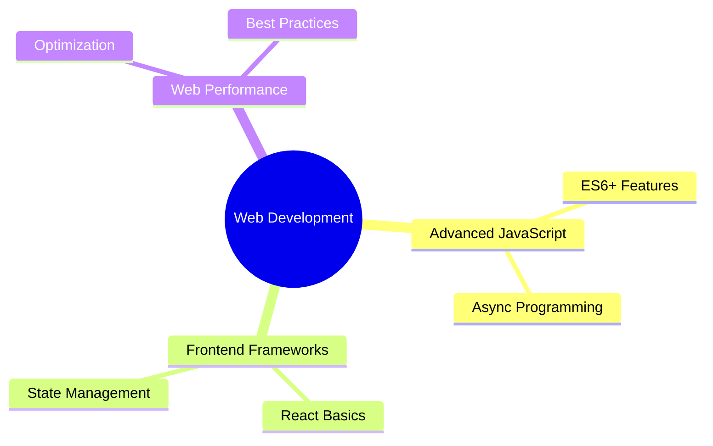

<div align="center">
  
</div>

<h1 align="center">
  <a href="https://git.io/typing-svg">
    
  </a>
</h1>

<p align="center">
  
</p>

<div align="center">
  
</div>

<h2>
   
  About Me
</h2>

```typescript
const hicham = {
    name: "Hicham Issoual",
    title: "Front-End Developer",
    location: "Morocco 🇲🇦",
    education: {
        degree: "Baccalauréat in SVT",
        school: "Lycée Iguig El Ksiba",
        year: "2021-2022"
    },
    currentFocus: "Self-taught Front-End Development journey",
    funFact: "I turn ☕ into <code/>",
    hobbies: ["Coding", "Learning", "Problem Solving"]
};
```

<h2>
   
  Technical Skills
</h2>

<div align="center">
  <table>
    <tr>
      <td align="center" width="96">
        
        <br>JavaScript
      </td>
      <td align="center" width="96">
        
        <br>GitHub
      </td>
      <td align="center" width="96">
        
        <br>HTML5
      </td>
      <td align="center" width="96">
        
        <br>CSS3
      </td>
      <td align="center" width="96">
        
        <br>Tailwind
      </td>
      <td align="center" width="96">
        
        <br>Rest APIs
      </td>
      <td align="center" width="96">
  
  <br>Git
</td>
    </tr>
  </table>

  <div align="center">
    
  </div>

  <!-- Skill Progress Bars -->
<div align="center">
  <h3>💫 Skill Levels</h3>
  
```text
HTML & CSS       ███████████████████░░   90%
JavaScript       ███████████████░░░░░░   75%
Tailwind CSS     ██████████████████░░░   85%
Git & GitHub     ████████████████░░░░░   80%
REST APIs        ████████████████░░░░░   70%
```
</div>
<h2>
   
  GitHub Analytics
</h2>

<p align="center">
  <a href="https://github.com/HichamIssoual">
    
    
  </a>
</p>

<p align="center">
  
</p>

<h2>📊 Contribution Graph</h2>

<div align="center">
  <a href="https://github.com/HichamIssoual">
    
  </a>
</div>
<h2>
   
  Current Learning Path
</h2>

<div align="center">



</div>

<h2>🎯 Future Goals</h2>

<div align="center">

| Short Term | Long Term |
|------------|-----------|
| Master JavaScript ES6+ | Become Full-Stack Developer |
| Learn React.js | Build Complex Web Applications |
| Improve UI/UX Skills | Contribute to Open Source |
| Build Portfolio Projects | Master System Design |

</div>

<h2>
   
  Connect With Me
</h2>

<p align="center">
  <a href="https://www.linkedin.com/in/hichamissoual-dev/" target="_blank">
    
  </a>
  <a href="https://x.com/hicham_dev" target="_blank">
    
  </a>
  <a href="mailto:hichamissoual.one@gmail.com">
    
  </a>
</p>

<!-- Profile Trophy -->
<p align="center">
  
</p>

<div align="center">
  
</div>
