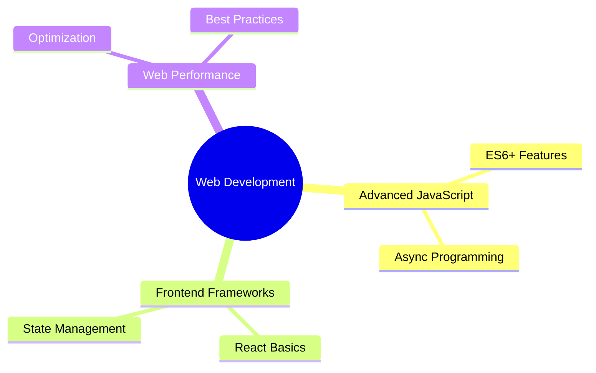

<div align="center">
  
</div>

<h1 align="center">
  
</h1>

<p align="center">
  
</p>

<div align="center">
  
</div>

##  About Me

```typescript
const hicham = {
    name: "Hicham Issoual",
    title: "Front-End Developer",
    location: "Morocco 🇲🇦",
    education: {
        degree: "Baccalauréat in SVT",
        school: "Lycée Iguig El Ksiba",
        year: "2021-2022"
    },
    currentFocus: "Self-taught Front-End Development journey",
    funFact: "I turn ☕ into <code/>",
    hobbies: ["Coding", "Learning", "Problem Solving"]
};
```

##  Skills & Tools

<div align="center">
  
### 🌐 Frontend Technologies


### 🛠️ Development Tools


### 🔄 APIs & Integration


</div>

##  GitHub Analytics

<p align="center">
  
</p>

<p align="center">
  
</p>

<p align="center">
  
</p>

## 📊 Contribution Graph

<div align="center">
  
</div>

<!-- Snake Animation -->
<div align="center">
  
</div>

##  Currently Learning

<div align="center">



</div>

## 🎯 Future Goals

<div align="center">

| Short Term | Long Term |
|------------|-----------|
| Master JavaScript ES6+ | Become Full-Stack Developer |
| Learn React.js | Build Complex Web Applications |
| Improve UI/UX Skills | Contribute to Open Source |
| Build Portfolio Projects | Master System Design |

</div>

##  Connect With Me

<p align="center">
  <a href="https://linkedin.com/in/YOUR_LINKEDIN">
    
  </a>
  <a href="https://twitter.com/YOUR_TWITTER">
    
  </a>
  <a href="mailto:YOUR_EMAIL">
    
  </a>
</p>

<div align="center">

```javascript
function lifeOfDeveloper() {
    while(alive) {
        eat();
        code();
        sleep();
        // Repeat until bugs are fixed
        if(bugs) continue;
    }
}
```

</div>

<!-- Profile Trophy -->
<p align="center">
  
</p>

<div align="center">
  
</div>
